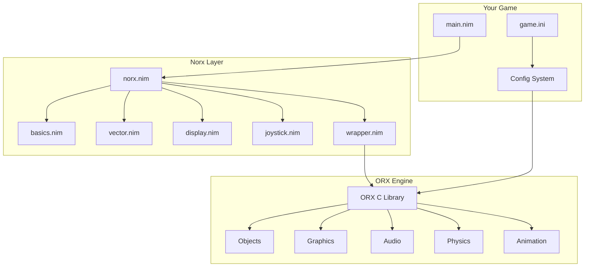
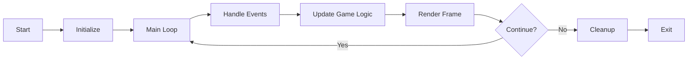
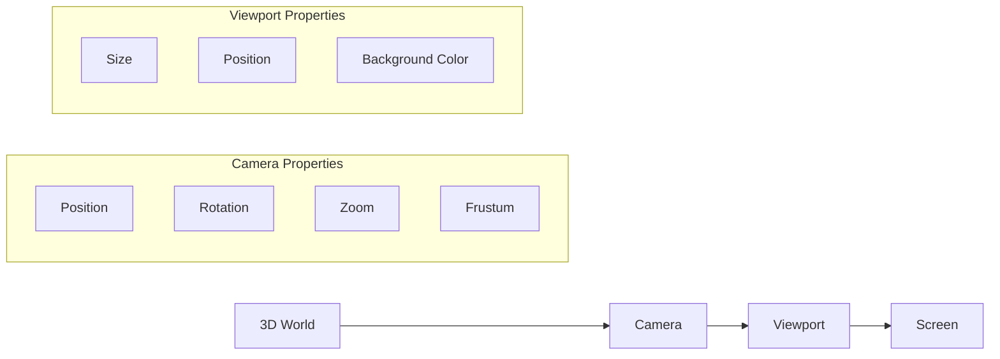
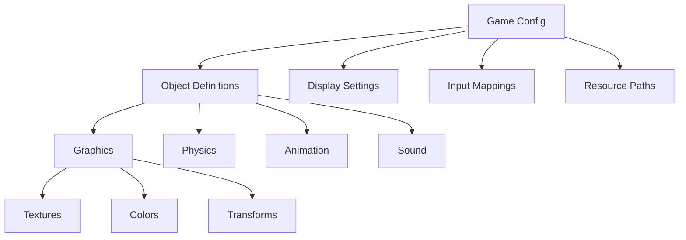
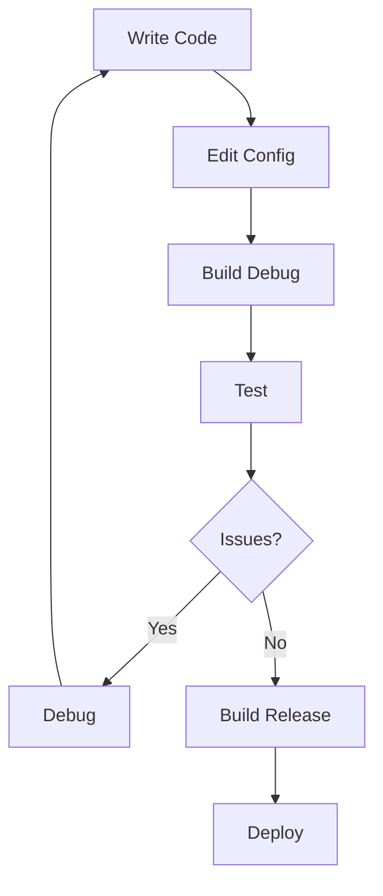

# Norx Game Development Tutorial

## Table of Contents
1. [Introduction](#introduction)
2. [Installation and Setup](#installation-and-setup)
3. [Project Structure](#project-structure)
4. [Core Concepts](#core-concepts)
5. [Building Your First Game](#building-your-first-game)
6. [Configuration System](#configuration-system)
7. [Advanced Features](#advanced-features)
8. [Build and Run Process](#build-and-run-process)
9. [Debugging and Testing](#debugging-and-testing)
10. [Resources and Next Steps](#resources-and-next-steps)

## Introduction

### What is Norx?

Norx is a **highly automated** Nim wrapper for the [ORX 2.5D game engine](https://orx-project.org/). It provides a powerful, cross-platform game development framework that combines the performance of the C99 ORX engine with the expressiveness of Nim.

### What is ORX?

ORX is an open-source, portable 2.5D game engine with these key features:

- **Cross-platform**: Windows, Linux, macOS, iOS, Android
- **Data-driven**: Configuration-based game development
- **3D accelerated**: OpenGL/OpenGL ES rendering
- **Comprehensive**: Audio, physics, animation, input handling
- **Lightweight**: Minimal dependencies, high performance
- **Free**: zlib license

### Why Use Norx?

- **Nim Integration**: Leverage Nim's powerful type system and metaprogramming
- **Automated Bindings**: Automatically generated low-level bindings stay up-to-date
- **High-level Abstractions**: Hand-crafted Nim modules for idiomatic code
- **Configuration-driven**: Change game behavior without recompiling
- **Memory Safe**: Nim's garbage collection with ORX's memory management
- **Cross-platform**: Write once, run everywhere

## Installation and Setup

### Prerequisites

Before starting, ensure you have:
- A C compiler (GCC, Clang, or MSVC)
- Git for version control
- Basic knowledge of Nim programming

### Step 1: Install Nim

```bash
# Using choosenim (recommended)
curl https://nim-lang.org/choosenim/init.sh -sSf | sh

# Or download from official site
# https://nim-lang.org/install.html
```

### Step 2: Clone and Setup ORX

```bash
# Clone the Norx repository
git clone https://github.com/gokr/norx.git
cd norx

# Initialize the ORX submodule
git submodule update --init
```

### Step 3: Build ORX Libraries

```bash
# Navigate to ORX directory
cd orx

# Run setup (installs dependencies and generates orxBuild.h)
./setup.sh

# IMPORTANT: Restart your shell or logout/login to get $ORX variable set!

# Build the libraries
cd code/build/linux/gmake  # or code/build/mac on macOS
make config=release64
make config=debug64
make config=profile64
```

### Step 4: Install ORX Libraries

```bash
# Copy libraries to system path
sudo cp -a $ORX/lib/dynamic/liborx* /usr/local/lib/

# Update library cache (Linux only)
sudo ldconfig
```

**Note for macOS**: Due to System Integrity Protection, you may need to copy libraries to your project directory instead of /usr/local/lib.

### Step 5: Install Norx

```bash
# Return to norx directory
cd ..

# Install Norx package
nimble install
```

### Step 6: Test Installation

```bash
# Test with sample project
cd samples/sample1
nimble run
```

If successful, you should see a window with a rotating logo!

## Project Structure

### Norx Architecture



### Directory Structure

```
your-game/
├── src/
│   └── main.nim              # Your game code
├── data/
│   ├── config/
│   │   └── game.ini          # Game configuration
│   ├── texture/              # Image files
│   ├── sound/                # Audio files
│   └── font/                 # Font files
├── config.nims               # Build configuration
├── game.nimble               # Package definition
└── README.md
```

### Key Files

- **main.nim**: Your game's entry point
- **game.ini**: Configuration file defining game behavior
- **config.nims**: Build settings and library linking
- **game.nimble**: Package metadata and dependencies

## Core Concepts

### The ORX Game Loop



### Objects and Scenes

In ORX, everything visible is an **Object**:

```nim
# Create an object from configuration
let player = objectCreateFromConfig("Player")

# Objects have properties
player.setPosition(vector(100.0, 200.0, 0.0))
player.setScale(vector(2.0, 2.0, 1.0))
player.setRotation(45.0)
```

### Viewports and Cameras

**Viewports** define screen regions, **Cameras** define what you see:



### Configuration System

ORX uses INI-style configuration files:

```ini
[Display]
Title = My Game
ScreenWidth = 1280
ScreenHeight = 720

[MainViewport]
Camera = MainCamera

[MainCamera]
FrustumWidth = 1280
FrustumHeight = 720
Position = (0, 0, -1)

[Player]
Graphic = PlayerGraphic
Position = (100, 200, 0)
Speed = (150, 0, 0)

[PlayerGraphic]
Texture = player.png
Pivot = center
```

## Building Your First Game

Let's create a simple game step by step.

### Step 1: Create Project Structure

```bash
mkdir my-game
cd my-game
mkdir -p src data/config data/texture
```

### Step 2: Create Package File

Create `my-game.nimble`:

```nim
# Package
version       = "0.1.0"
author        = "Your Name"
description   = "My first Norx game"
license       = "MIT"
installDirs   = @["data"]
bin           = @["my_game"]

# Dependencies
requires "nim >= 2.0.0"
requires "norx >= 0.7.0"
```

### Step 3: Create Build Configuration

Create `config.nims`:

```nim
# Link to appropriate ORX library based on build type
when defined(release):
  switch("passL", "-lorx")      # Release version
elif defined(profile):
  switch("passL", "-lorxp")     # Profile version  
else:
  switch("passL", "-lorxd")     # Debug version (default)
```

### Step 4: Create Game Configuration

Create `data/config/my_game.ini`:

```ini
[Display]
Title = My First Norx Game
ScreenWidth = 800
ScreenHeight = 600
VSync = true
Smoothing = true

[Resource]
Texture = ./data/texture

[Input]
SetList = MainInput

[MainInput]
KEY_ESCAPE = Quit
KEY_SPACE = Jump
KEY_LEFT = MoveLeft
KEY_RIGHT = MoveRight

[MainViewport]
Camera = MainCamera

[MainCamera]
FrustumWidth = 800
FrustumHeight = 600
FrustumFar = 2
FrustumNear = 0
Position = (0, 0, -1)

[Scene]
ChildList = Player

[Player]
Graphic = PlayerGraphic
Position = (0, 0, 0)
Scale = (1, 1, 1)

[PlayerGraphic]
Texture = player.png
Pivot = center
```

### Step 5: Create Game Code

Create `src/my_game.nim`:

```nim
import norx

# We need cdecl for all callback functions
{.push cdecl.}

# Game state
var player: ptr orxOBJECT = nil

proc update(clockInfo: ptr orxCLOCK_INFO, context: pointer) =
  # Handle input
  var movement = vector(0.0, 0.0, 0.0)
  
  if isActive("MoveLeft"):
    movement.fX = -200.0
  elif isActive("MoveRight"):
    movement.fX = 200.0
  
  if isActive("Jump"):
    movement.fY = -300.0
  
  # Apply movement
  if not player.isNil:
    player.setSpeed(movement)
  
  # Check for quit
  if isActive("Quit"):
    discard eventSendShort(EVENT_TYPE_SYSTEM, SYSTEM_EVENT_CLOSE.orxU32)

proc init(): orxSTATUS =
  echo "Starting My First Norx Game"
  
  # Create viewport
  let viewport = viewportCreateFromConfig("MainViewport")
  if viewport.isNil:
    echo "Failed to create viewport"
    return STATUS_FAILURE
  
  # Create player
  player = objectCreateFromConfig("Player")
  if player.isNil:
    echo "Failed to create player"
    return STATUS_FAILURE
  
  # Register update callback
  let clock = clockGet(CLOCK_KZ_CORE)
  if clock.isNil:
    echo "Failed to get core clock"
    return STATUS_FAILURE
  
  let status = clockRegister(clock, update, nil, MODULE_ID_MAIN, CLOCK_PRIORITY_NORMAL)
  if status != STATUS_SUCCESS:
    echo "Failed to register update callback"
    return STATUS_FAILURE
  
  echo "Game initialized successfully"
  return STATUS_SUCCESS

proc run(): orxSTATUS = STATUS_SUCCESS

proc exit() = 
  echo "Game exiting"

proc bootstrap(): orxSTATUS =
  # Setup resource paths
  let result = addStorage(CONFIG_KZ_RESOURCE_GROUP, "data/config", false)
  if result != STATUS_SUCCESS:
    echo "Failed to add config storage"
    return STATUS_FAILURE
  
  return STATUS_SUCCESS

# Main execution
when isMainModule:
  if setBootstrap(bootstrap) == STATUS_SUCCESS:
    execute(init, run, exit)
  else:
    echo "Failed to set bootstrap"
  
  quit(0)
```

### Step 6: Add Assets

Add a `player.png` image to `data/texture/` directory.

### Step 7: Build and Run

```bash
# Build and run
nim c -r src/my_game.nim

# Or using nimble
nimble run
```

Congratulations! You've created your first Norx game with basic input handling and object management.

## Configuration System

### Configuration Hierarchy

ORX uses a hierarchical configuration system:



### Configuration Features

#### References and Inheritance
```ini
[BaseEnemy]
Graphic = EnemyGraphic
Health = 100
Speed = (50, 0, 0)

[FastEnemy]
UseParent = BaseEnemy
Speed = (100, 0, 0)  # Override parent value

[SlowEnemy]
UseParent = BaseEnemy
Speed = (25, 0, 0)
```

#### Dynamic Values
```ini
[Player]
Position = (400, 300, 0)  # Center of 800x600 screen
Scale = (@Display.ScreenWidth / 800, @Display.ScreenHeight / 600, 1)
```

#### Lists and Arrays
```ini
[Scene]
ChildList = Player # Enemy1 # Enemy2 # Powerup

[Enemy1]
Graphic = EnemyGraphic
Position = (100, 100, 0)

[Enemy2]
Graphic = EnemyGraphic
Position = (700, 100, 0)
```

### Common Configuration Patterns

#### Responsive Display
```ini
[Display]
ScreenWidth = 1920
ScreenHeight = 1080
Title = My Game
FullScreen = false
VSync = true

[MainCamera]
FrustumWidth = @Display.ScreenWidth
FrustumHeight = @Display.ScreenHeight
```

#### Input Mapping
```ini
[MainInput]
KEY_ESCAPE = Quit
KEY_SPACE = Jump
KEY_W = MoveUp
KEY_S = MoveDown
KEY_A = MoveLeft
KEY_D = MoveRight
MOUSE_LEFT = Fire
JOYSTICK_1_A = Jump
```

#### Animation Configuration
```ini
[PlayerWalk]
KeyDuration = 0.1
KeyData1 = walk_01.png
KeyData2 = walk_02.png
KeyData3 = walk_03.png
KeyData4 = walk_04.png
```

## Advanced Features

### Animation System

```nim
# Create animation set
let animSet = animSetCreateFromConfig("PlayerAnimations")
if not animSet.isNil:
  player.linkStructure(animSet, orxSTRUCTURE_ID_ANIMSET)

# Control animations
player.setCurrentAnim("Walk")
player.setAnimFrequency(2.0)  # 2x speed
```

### Physics Integration

```ini
[Player]
Graphic = PlayerGraphic
Body = PlayerBody

[PlayerBody]
Dynamic = true
PartList = PlayerPart

[PlayerPart]
Type = box
TopLeft = (-16, -16, 0)
BottomRight = (16, 16, 0)
```

### Sound System

```ini
[PlayerSound]
SoundList = FootstepsSound # JumpSound

[FootstepsSound]
Sound = footsteps.ogg
Loop = true
Volume = 0.5

[JumpSound]
Sound = jump.wav
Volume = 0.8
```

### Visual Effects

```ini
[PlayerFX]
SlotList = FadeIn # Glow

[FadeIn]
Type = alpha
Curve = smooth
StartTime = 0
EndTime = 1
StartValue = 0
EndValue = 1

[Glow]
Type = scale
Curve = sine
StartTime = 0
EndTime = 2
StartValue = (1, 1, 1)
EndValue = (1.2, 1.2, 1)
Loop = true
```

## Build and Run Process

### Development Workflow



### Build Configurations

#### Debug Build (Default)
```bash
nim c -r src/my_game.nim
```
- Links to `liborxd` (debug version)
- Includes debug symbols
- Slower but easier to debug

#### Release Build
```bash
nim c -d:release -r src/my_game.nim
```
- Links to `liborx` (optimized version)
- Smaller executable
- Better performance

#### Profile Build
```bash
nim c -d:profile -r src/my_game.nim
```
- Links to `liborxp` (profile version)
- Includes profiling support
- Performance monitoring

### Cross-Platform Considerations

#### Platform-Specific Code
```nim
when defined(Windows):
  # Windows-specific code
elif defined(Linux):
  # Linux-specific code
elif defined(MacOSX):
  # macOS-specific code
```

#### Asset Management
```ini
[Resource]
Texture = ./data/texture
Sound = ./data/sound
Font = ./data/font
Config = ./data/config
```

### Deployment

#### Linux
```bash
# Build static executable
nim c -d:release --passL:-static src/my_game.nim

# Create distribution package
tar -czf my-game-linux.tar.gz my_game data/
```

#### Windows
```bash
# Cross-compile from Linux
nim c -d:mingw -d:release src/my_game.nim

# Or build on Windows
nim c -d:release src/my_game.nim
```

#### macOS
```bash
# Build universal binary
nim c -d:release src/my_game.nim

# Create app bundle
mkdir -p MyGame.app/Contents/MacOS
cp my_game MyGame.app/Contents/MacOS/
cp -r data MyGame.app/Contents/Resources/
```

## Debugging and Testing

### Debug Features

#### Logging
```nim
# Enable debug output
when defined(debug):
  echo "Player position: ", player.getPosition()
```

#### Visual Debugging
```ini
[Display]
ShowFPS = true
ShowProfiler = true

[Debug]
ShowObjectBounds = true
ShowPhysics = true
```

### Common Issues and Solutions

#### Library Not Found
```bash
# Check library path
ldd my_game
export LD_LIBRARY_PATH=$LD_LIBRARY_PATH:/usr/local/lib
```

#### Configuration Errors
```nim
# Validate configuration
let result = loadFromFile("data/config/my_game.ini")
if result != STATUS_SUCCESS:
  echo "Configuration error!"
```

#### Memory Issues
```nim
# Proper cleanup
proc exit() =
  if not player.isNil:
    player.setLifeTime(0.0)  # Let ORX handle cleanup
  echo "Cleanup complete"
```

### Testing Strategies

#### Unit Testing
```nim
# Test game logic
import unittest

test "Player movement":
  let initialPos = player.getPosition()
  # Simulate movement
  player.setSpeed(vector(100.0, 0.0, 0.0))
  # Update simulation
  clockUpdate()
  # Check result
  let newPos = player.getPosition()
  check(newPos.fX > initialPos.fX)
```

#### Integration Testing
```bash
# Automated testing
nimble test

# Performance testing
nim c -d:release -d:profile src/my_game.nim
./my_game --benchmark
```

## Resources and Next Steps

### Learning Resources

#### Official Documentation
- [ORX Website](https://orx-project.org/)
- [ORX Wiki](https://orx-project.org/wiki/)
- [Norx Repository](https://github.com/gokr/norx)

#### Sample Projects
- `samples/` - Basic Norx examples
- `official_samples/` - Comprehensive ORX tutorials
- [Norx Sample](https://github.com/gokr/norxsample) - Extended example

#### Community
- ORX Discord/Forums
- Nim Community
- GitHub Issues for support

### Advanced Topics

#### Custom Shaders
```ini
[PlayerGraphic]
Texture = player.png
Shader = CustomShader

[CustomShader]
Code = custom_shader.glsl
```

#### Networking
```nim
# Multiplayer considerations
when defined(multiplayer):
  import asyncdispatch  # Note: Avoid this, use taskpools
  import taskpools      # Recommended for concurrency
```

#### Mobile Development
```bash
# Android build
nimble build-android

# iOS build (requires macOS)
nimble build-ios
```

### Performance Optimization

#### Profiling
```bash
# Enable profiling
nim c -d:profile --profiler:on src/my_game.nim
```

#### Memory Management
```nim
# Efficient object pooling
var objectPool: seq[ptr orxOBJECT]

proc getPooledObject(): ptr orxOBJECT =
  if objectPool.len > 0:
    result = objectPool.pop()
  else:
    result = objectCreate()
```

#### Asset Optimization
- Use compressed textures
- Optimize audio files
- Minimize configuration complexity

### Next Steps

1. **Complete the Tutorials**: Work through all official samples
2. **Build a Full Game**: Create a complete project
3. **Contribute**: Submit improvements to Norx
4. **Share**: Release your game to the community

### Conclusion

Norx provides a powerful foundation for game development, combining ORX's proven engine with Nim's modern language features. The configuration-driven approach allows rapid iteration and easy maintenance, while the cross-platform nature ensures wide compatibility.

Start with simple projects, gradually explore advanced features, and don't hesitate to ask the community for help. Happy game development!

---

*This tutorial is a living document. Please contribute improvements and corrections to help other developers.*