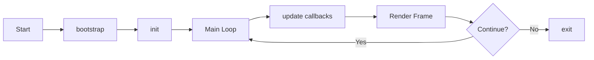

# Norx Game Development Tutorial

## Table of Contents

1. [Introduction](#introduction)
2. [Installation and Setup](#installation-and-setup)
3. [Project Structure](#project-structure)
4. [Core Concepts](#core-concepts)
5. [Configuration](#configuration)
6. [Input](#input)
7. [Clocks](#clocks)
8. [Text and UI](#text-and-ui)
9. [Sounds and FX](#sounds-and-fx)
10. [Physics](#physics)
11. [Spawning](#spawning)
12. [Animations](#animations)
13. [Building Your First Game](#building-your-first-game)
14. [Debugging and Testing](#debugging-and-testing)
15. [Deployment](#deployment)
16. [Resources and Next Steps](#resources-and-next-steps)

## Introduction

### What is Norx?

Norx is a **highly automated** Nim wrapper for the [ORX 2.5D game engine](https://orx-project.org/). It pairs the battle-tested C99 ORX engine with the expressiveness of Nim.

### What is ORX?

ORX is an open-source, portable 2.5D game engine:

- **Cross-platform**: Windows, Linux, macOS, iOS, Android
- **Data-driven**: most game content lives in INI-style configuration
- **3D accelerated**: OpenGL / OpenGL ES rendering
- **Comprehensive**: audio, physics, animation, FX, input, spawning
- **Lightweight**: minimal dependencies, high performance
- **Free**: zlib license

### Why use Norx?

- **Automated bindings**: the low-level wrapper is generated from ORX headers with Futhark
- **Idiomatic Nim layer**: value vectors with operators, plain `bool` and `string` arguments, explicit status predicates
- **Configuration-driven**: change game behavior without recompiling
- **Memory safe**: Nim's ORC garbage collector plus ORX's own resource management
- **Cross-platform**: write once, run everywhere

## Installation and Setup

### Prerequisites

- Nim 2.2.4 or newer (via [choosenim](https://nim-lang.org/install.html) or your package manager)
- A C compiler (GCC, Clang, or MSVC)
- Git

### Clone the repository

```bash
git clone https://github.com/tankfeud/norx.git
cd norx
git submodule update --init
```

### Build ORX

```bash
# Prepare the ORX submodule; installs dependencies and generates orxBuild.h
cd orx
./setup.sh
# IMPORTANT: restart your shell (or logout/login) afterwards to get $ORX set!

# Build the three library flavors
cd code/build/linux/gmake   # or code/build/mac on macOS
make config=debug64
make config=profile64       # optional, only needed for -d:profile builds
make config=release64
```

On a clean Ubuntu, `setup.sh` asks you to install some packages, typically:
`sudo apt install libgl1-mesa-dev libsndfile1-dev libopenal-dev libxrandr-dev`.

**No system-wide install is needed.** Every test and sample in this repository
links and runs directly against `orx/code/lib/dynamic`: each `config.nims`
adds that directory to the linker search path and embeds an rpath. Only
projects *outside* the repository need the libraries installed or pointed at
explicitly — see [Deployment](#deployment).

### Install Norx

```bash
# Back in the repository root
nimble install
```

### Run a sample

```bash
cd samples/ball
nim c ball.nim
./ball         # hold the right arrow key
```

If successful you see a dark window with a pulsing yellow ball that moves
while you hold the key. `samples/pong` and `samples/boulderdash` are complete
games in the same directory.

## Project Structure

### Repository layout

```
norx/
├── src/                # The Norx wrapper (import "norx")
│   ├── norx.nim        #   public entry point, exports the others
│   ├── wrapper.nim     #   Futhark-generated low-level bindings
│   ├── basics.nim      #   booleans, statuses, math constants
│   ├── vector.nim      #   vector values and operators
│   ├── objects.nim     #   object value/string overloads
│   └── ...             #   input, config, sounds, resources, ...
├── tests/              # Regression tests
├── samples/            # Standalone samples and games
│   ├── ball/           #   the smallest possible program
│   ├── pong/           #   complete two-player Pong
│   └── boulderdash/    #   complete grid game
├── official/          # Nim ports of the official ORX tutorials
└── orx/                # ORX 1.17 Git submodule
```

### Your own project layout

```
your-game/
├── src/
│   └── my_game.nim         # Your game code
├── data/
│   ├── config/
│   │   └── my_game.ini     # Game configuration
│   ├── texture/            # Image files
│   ├── sound/              # Audio files
│   └── font/               # Font files
├── config.nims             # Build configuration
├── my_game.nimble          # Package definition
└── README.md
```

## Core Concepts

### The ORX game loop


```mermaid
flowchart LR
    A[Start] --> B[bootstrap]
    B --> C[init]
    C --> D[Main Loop]
    D --> E[update callbacks]
    E --> F[Render Frame]
    F --> G{Continue?}
    G -->|Yes| D
    G -->|No| H[exit]
```

Your game provides four functions to `execute`:

- `init`: called after ORX modules are ready — create viewports, objects,
  and register callbacks. Return `STATUS_FAILURE` to abort startup.
- `run`: called once per frame. Return `STATUS_FAILURE` to stop the game.
- `exit`: called before shutdown — release what you created.
- `bootstrap`: called before configuration loads — add resource storage
  locations. Register it with `setBootstrap` before `execute`.

Callbacks passed to ORX must be marked `{.cdecl.}`. A global `{.push cdecl.}`
is the convenient way to mark a whole section of code.

### The smallest program

`ball.nim` from `samples/ball/` is a complete Norx program:

```nim
import norx

var ball: ptr orxOBJECT

proc update(info: ptr orxCLOCK_INFO,
            ctx: pointer) {.cdecl.} =
  let dt = info.fDT.float32
  if isActive("MoveRight"):   # nim bools, nim strings
    let speed = newVector(340.0, 0.0)
    discard ball.setPosition(
      ball.getPosition() + speed * dt)  # value vectors

proc init(): orxSTATUS {.cdecl.} =
  discard viewportCreateFromConfig("MainViewport")
  ball = objectCreateFromConfig("Ball")
  clockRegister(clockGet(CLOCK_KZ_CORE), update,
                nil, MODULE_ID_MAIN,
                CLOCK_PRIORITY_NORMAL)

proc run(): orxSTATUS {.cdecl.} = STATUS_SUCCESS
proc exit() {.cdecl.} = discard

execute(init, run, exit)
```

It loads `ball.ini` automatically from its own directory. Everything visible
on screen comes from the `[Ball]` section in that file.

### Objects and scenes

In ORX, everything visible is an **Object**:

```nim
# Create an object from a configuration section
let player = objectCreateFromConfig("Player")

# Objects have properties
discard player.setPosition(newVector(100.0, 200.0))
discard player.setScale(newVector(2.0, 2.0, 1.0))
discard player.setRotation(45.0)
```

A **Scene** is just an object whose children are created from config:

```ini
[Scene]
ChildList = Sky # Player # Enemies

[Player]
Graphic = PlayerGraphic
Position = (0, 0, 0)
```

```nim
discard objectCreateFromConfig("Scene")  # creates Sky, Player, Enemies
```

### Vectors

Vectors keep ORX's `orxVECTOR` type and function names, with value overloads
and conventional operators for Nim expressions:

```nim
let velocity = newVector(120.0, -30.0)
let nextPosition = player.getPosition() + velocity * deltaTime
let direction = velocity.normalize
let distance = getDistance(player.getPosition(), enemy.getPosition())
```

The generated pointer overloads remain available for direct translations from
ORX documentation. Common object properties also accept and return vector
values, so temporary variables and `addr` are usually unnecessary.

### Booleans

Norx converts between ORX's ABI-compatible `orxBOOL` type and Nim's `bool`.
Use normal Nim conditions and boolean values while keeping the original ORX
function names:

```nim
if isActive("Jump"):
  discard player.enable(true)
```

The `orxTRUE` and `orxFALSE` constants remain available when translating ORX
documentation literally, but application code normally does not need them.

### Status values

ORX operations return `orxSTATUS`, which remains an enum so callbacks and
control-flow uses retain their original meaning. Norx supplies explicit
predicates for conditions:

```nim
if clockRegister(clock, update, nil, MODULE_ID_MAIN,
                 CLOCK_PRIORITY_NORMAL).isFailure:
  return STATUS_FAILURE
```

Use `isSuccess` or `isFailure` when testing an operation. Callback return
values remain `STATUS_SUCCESS` and `STATUS_FAILURE` as documented by ORX.

### Strings

Common ORX calls accept normal Nim strings, including dynamically constructed
values:

```nim
let section = "Player" & $playerNumber
let player = objectCreateFromConfig(section)
discard player.setTextString("Score: " & $score)
discard player.addSound("JumpSound")
discard player.addFX("Bump")
```

Norx converts the argument only for the duration of the call. String pointers
returned by ORX remain borrowed `cstring` values; copy one with `$` when it
must outlive ORX's storage.

### Viewports and cameras

**Viewports** define screen regions, **Cameras** define what you see:

```ini
[MainViewport]
Camera          = MainCamera
BackgroundColor = (8, 12, 24)

[MainCamera]
FrustumWidth    = 960
FrustumHeight   = 540
FrustumFar      = 2
FrustumNear     = 0
Position        = (0, 0, -1)
```

```nim
discard viewportCreateFromConfig("MainViewport")
```

Keep `FrustumWidth`/`FrustumHeight` in sync with `[Display] ScreenWidth`/
`ScreenHeight` for a 1:1 pixel mapping, or reference them dynamically as
shown in [Configuration](#configuration).

## Configuration

ORX uses INI-style configuration files for almost everything.

### Sections, keys, values

```ini
[Display]
Title       = My Game
ScreenWidth = 1280
ScreenHeight = 720
VSync       = true

[Player]
Graphic   = PlayerGraphic
Position  = (100, 200, 0)
Speed     = (150, 0, 0)

[PlayerGraphic]
Texture   = player.png
Pivot     = center
```

Comments start with `;`. Vectors are comma-separated tuples, lists use `#` as
the separator, and booleans are `true`/`false`.

### Inheritance

Any section can inherit from another by appending `@ParentSection` to its
name:

```ini
[EnemyGraphic]
Texture = enemy.png
Pivot   = center
Color   = (255, 255, 255)

[Enemy]
Graphic = EnemyGraphic
Health  = 100
Speed   = (50, 0, 0)

[FastEnemy@Enemy]
Speed = (100, 0, 0)   ; override the parent value

[AngryEnemy@Enemy]
Color = (255, 80, 80) ; inherited by EnemyGraphic too, via @
Graphic = @           ; reuse the same graphic, override its color
```

### References and dynamic values

Use `@Section.Key` to reference another value, and compute at load time:

```ini
[Display]
ScreenWidth  = 960
ScreenHeight = 540

[MainCamera]
FrustumWidth  = @Display.ScreenWidth
FrustumHeight = @Display.ScreenHeight

[Player]
Scale = (1.5 * @Display.ScreenWidth / 960, 1, 1)
```

### ChildList

Parent objects create their children from a list:

```ini
[Scene]
ChildList = Sky # Player # Enemy1 # Enemy2

[Enemy1]
Graphic   = EnemyGraphic
Position  = (100, 100, 0)

[Enemy2]
Graphic   = EnemyGraphic
Position  = (700, 100, 0)
```

## Input

### Edge-triggered vs level

Norx input functions accept plain strings:

```nim
if hasBeenActivated("Jump"):   # pressed this frame only
  doJump()

if isActive("MoveRight"):      # held down right now
  moveRight(dt)

if hasBeenDeactivated("Run"):  # released this frame
  stopRunning()

if hasNewStatus("Pause"):      # pressed or released this frame
  togglePause()
```

### Analog values

```nim
let throttle = getValue("Throttle")  # 0..1, works for keys, buttons and axes
```

### Bindings

```ini
[Input]
SetList = MainInput

[MainInput]
KEY_ESCAPE  = Quit
KEY_SPACE   = Jump
KEY_W       = MoveUp
KEY_S       = MoveDown
KEY_A       = MoveLeft
KEY_D       = MoveRight
MOUSE_LEFT  = Fire
JOY_A_1     = Jump     ; first gamepad, A button
JOY_LX_1    = MoveX    ; first gamepad, left stick X axis
```

## Clocks

### The core clock

The core clock ticks once per frame. Register update callbacks on it in
`init`:

```nim
discard clockRegister(clockGet(CLOCK_KZ_CORE), update, nil,
                      MODULE_ID_MAIN, CLOCK_PRIORITY_NORMAL)
```

`update` receives the elapsed frame time:

```nim
proc update(clockInfo: ptr orxCLOCK_INFO, context: pointer) {.cdecl.} =
  let dt = clockInfo.fDT.float32     # seconds since last frame
  let t = clockInfo.fTime.float32    # accumulated time on this clock
```

### Custom clocks

Additional clocks tick at their own fixed rates and can be time-stretched:

```ini
[PhysicsClock]
TickSize = 0.01   ; 100 Hz
```

```nim
let physicsClock = clockCreateFromConfig("PhysicsClock")
discard clockRegister(physicsClock, fixedUpdate, nil,
                      MODULE_ID_MAIN, CLOCK_PRIORITY_NORMAL)

# Slow-motion and fast-forward from the core clock callback:
if isActive("SlowMo"):
  discard physicsClock.setModifier(CLOCK_MODIFIER_MULTIPLY, 0.25)
else:
  discard physicsClock.setModifier(CLOCK_MODIFIER_MULTIPLY, 1.0)
```

## Text and UI

Text is an object whose graphic is a text graphic. Use both `Graphic = @`
and `Text = @`:

```ini
[Hud]
Graphic   = @
Text      = @
Locale    = false
String    = Score: 0
Position  = (-300, -220, -0.5)
Pivot     = center
Scale     = 1.5
Color     = (235, 240, 255)
```

```nim
discard hud.setTextString("Score: " & $score)
```

`Locale = false` uses the string literally; with locale enabled the value is
a translation key. Hide messages with `hud.enable(false)`.

## Sounds and FX

Sounds and visual effects are also data-driven. The configuration for Pong's
paddle hit looks like this:

```ini
[PaddleSound]
Sound       = push.ogg
KeepInCache = true
Volume      = 0.3

[PaddleHit]
SlotList    = PaddleHitScale
DoNotCache  = true

[PaddleHitScale]
Type        = scale
StartTime   = 0
EndTime     = 0.12
Curve       = sine
StartValue  = (1, 1, 1)
EndValue    = (1.18, 1.18, 1)
```

Trigger both from Nim:

```nim
discard ball.addSound("PaddleSound")
discard paddle.addFX("PaddleHit")
```

ORX stops the sound when its owner is deleted, and `DoNotCache` keeps the FX
fresh when it is re-added every frame.

## Physics

### Bodies and parts

Attach a body with one or more parts to give an object physical presence:

```ini
[Physics]
Gravity        = (0, -981, 0)
DimensionRatio = 0.01

[Player]
Graphic = PlayerGraphic
Body    = PlayerBody

[PlayerBody]
Dynamic       = true
PartList      = PlayerPart

[PlayerPart]
Type          = box
TopLeft       = (-16, -16, 0)
BottomRight   = (16, 16, 0)
Restitution   = 0.2
Friction      = 0.8
SelfFlags     = 0x0001   ; who I am
CheckMask     = 0xFFFF   ; who I collide with
Solid         = true
```

Static bodies (`Dynamic = false`) are walls and floors. Two objects collide
when `(A.SelfFlags & B.CheckMask) and (A.CheckMask & B.SelfFlags)`.

Not every game needs ORX physics: both Pong and Boulder Dash implement their
own fixed-step movement and collision rules in plain Nim while using ORX for
rendering, input and sound. That is a perfectly idiomatic Norx choice.

### Collision events

```nim
proc physicsHandler(event: ptr orxEVENT): orxSTATUS {.cdecl.} =
  if event.eID == ord(PHYSICS_EVENT_CONTACT_ADD):
    let a = cast[ptr orxOBJECT](event.hRecipient)
    let b = cast[ptr orxOBJECT](event.hSender)
    discard a.addFX("Bump")
    discard b.addFX("Bump")
  result = STATUS_SUCCESS

# in init:
discard addHandler(EVENT_TYPE_PHYSICS, physicsHandler)
```

## Spawning

Spawners create objects in waves, defined entirely in config:

```ini
[EnemySpawner]
Spawner     = @
Object      = Enemy
TotalObject = 10
WaveSize    = 5
WaveDelay   = 1.0

[Scene]
ChildList = Player # EnemySpawner
```

```nim
let spawner = spawnerCreateFromConfig("EnemySpawner")
spawner.enable(true)   # returns void — no discard needed
```

## Animations

Animation sets cycle through textures defined in config:

```ini
[PlayerAnimations]
KeyDuration = 0.1
KeyData1    = walk_01.png
KeyData2    = walk_02.png
KeyData3    = walk_03.png
KeyData4    = walk_04.png
```

```nim
let animSet = animSetCreateFromConfig("PlayerAnimations")
if animSet != nil:
  discard player.linkStructure(cast[ptr orxSTRUCTURE](animSet))
discard player.setCurrentAnim("Walk")
discard player.setAnimFrequency(2.0)  # 2x speed
```

## Building Your First Game

Let's create a simple game step by step.

### Step 1: Create the project

```bash
mkdir my-game
cd my-game
mkdir -p src data/config data/texture
```

### Step 2: Create the package file

Create `my_game.nimble`:

```nim
# Package
version       = "0.1.0"
author        = "Your Name"
description   = "My first Norx game"
license       = "MIT"
srcDir        = "src"
installDirs   = @["data"]
bin           = @["my_game"]

# Dependencies
requires "nim >= 2.2.4"
requires "norx >= 0.8.1"
```

### Step 3: Create the build configuration

Create `config.nims`. Inside the Norx repository nothing special is needed,
but an independent project points at the ORX library directory:

```nim
import std/os

let rootDir = currentSourcePath().parentDir
let orxLibraryDir = normalizedPath(rootDir / "/path/to/orx/code/lib/dynamic")

switch("path", rootDir / "src")
switch("passL", "-L" & orxLibraryDir)

when defined(linux) or defined(macosx):
  switch("passL", "-Wl,-rpath," & orxLibraryDir)

when defined(release):
  switch("passL", "-lorx")      # Release version
elif defined(profile):
  switch("passL", "-lorxp")     # Profile version
else:
  switch("passL", "-lorxd")     # Debug version (default)
```

Replace `/path/to/orx` with the actual location of your ORX checkout. If you
installed ORX system-wide instead, you only need the three `-lorx*` lines.

### Step 4: Create the game configuration

Create `data/config/my_game.ini`:

```ini
[Display]
Title        = My First Norx Game
ScreenWidth  = 800
ScreenHeight = 600
VSync        = true

[Resource]
Texture = ./data/texture

[Input]
SetList = MainInput

[MainInput]
KEY_ESCAPE  = Quit
KEY_LEFT    = MoveLeft
KEY_RIGHT   = MoveRight

[MainViewport]
Camera = MainCamera

[MainCamera]
FrustumWidth  = 800
FrustumHeight = 600
FrustumFar    = 2
FrustumNear   = 0
Position      = (0, 0, -1)

[Player]
Graphic   = PlayerGraphic
Position  = (0, 0, 0)

[PlayerGraphic]
Texture   = player.png
Pivot     = center
```

### Step 5: Create the game code

Create `src/my_game.nim`:

```nim
import norx

# We need cdecl for all callback functions
{.push cdecl.}

# Game state
var player: ptr orxOBJECT = nil

proc update(clockInfo: ptr orxCLOCK_INFO, context: pointer) =
  let dt = clockInfo.fDT.float32

  if isActive("MoveLeft"):
    discard player.setSpeed(newVector(-200.0, 0.0))
  elif isActive("MoveRight"):
    discard player.setSpeed(newVector(200.0, 0.0))
  else:
    discard player.setSpeed(newVector())

  if isActive("Quit"):
    discard eventSendShort(EVENT_TYPE_SYSTEM, SYSTEM_EVENT_CLOSE.orxU32)

proc init(): orxSTATUS =
  echo "Starting My First Norx Game"

  if viewportCreateFromConfig("MainViewport") == nil:
    echo "Failed to create viewport"
    return STATUS_FAILURE

  player = objectCreateFromConfig("Player")
  if player.isNil:
    echo "Failed to create player"
    return STATUS_FAILURE

  if clockRegister(clockGet(CLOCK_KZ_CORE), update, nil,
                   MODULE_ID_MAIN, CLOCK_PRIORITY_NORMAL).isFailure:
    echo "Failed to register update callback"
    return STATUS_FAILURE

  echo "Game initialized successfully"
  return STATUS_SUCCESS

proc run(): orxSTATUS = STATUS_SUCCESS

proc exit() =
  echo "Game exiting"

proc bootstrap(): orxSTATUS =
  if addStorage(CONFIG_KZ_RESOURCE_GROUP, "data/config", false).isFailure:
    echo "Failed to add config storage"
    return STATUS_FAILURE
  return STATUS_SUCCESS

# Main execution
when isMainModule:
  if setBootstrap(bootstrap).isFailure:
    quit("Failed to set bootstrap")
  execute(init, run, exit)
```

### Step 6: Add assets

Put a `player.png` in `data/texture/`. ORX's built-in `pixel` texture works
for simple placeholders while you are looking for art:

```ini
[PlayerGraphic]
Texture = pixel
Color   = (255, 213, 74)
Size    = (32, 32, 0)
```

### Step 7: Build and run

```bash
# From the project root
nimble build
./my_game
```

Congratulations! You've created your first Norx game with input handling,
objects, a camera and a data-driven configuration.

## Debugging and Testing

### ORX logging

A debug build (`liborxd`) is far more talkative than release and writes
`<program>-debug.log` next to your binary. Log levels are set in code:

```nim
# Show only errors, or everything, from a debug build
internal_orxDebug_SetFlags(DEBUG_KU32_STATIC_MASK_DEBUG, DEBUG_KU32_STATIC_MASK_USER_ALL)
```

### The ORX console

Press the key below Escape (`` ` `` on many keyboards) while a game runs to
open ORX's built-in console for live config editing and inspection.

### Startup self-tests

Pong and Boulder Dash ship a `--startup-test` mode: they initialize the full
scene, validate the game model and engine wiring, and exit automatically with
a non-zero status on failure. The skeleton looks like this:

```nim
let startupTest = "--startup-test" in commandLineParams()
var startupFrames = 0

proc init(): orxSTATUS {.cdecl.} =
  # create everything...
  if startupTest and not runSelfChecks():
    return STATUS_FAILURE
  result = clockRegister(clockGet(CLOCK_KZ_CORE), update, nil,
                         MODULE_ID_MAIN, CLOCK_PRIORITY_NORMAL)

proc run(): orxSTATUS {.cdecl.} =
  if startupTest:
    inc startupFrames
    if startupFrames >= 5:
      return STATUS_FAILURE
  result = STATUS_SUCCESS
```

Run `./pong --startup-test true` after every change for a cheap smoke test.

## Deployment

### Bundling libraries

Your game links against a shared ORX library. For distribution:

- **Linux**: ship `liborx.so` next to the executable and embed a relative
  rpath with `-Wl,-rpath,$ORIGIN`, or install the library system-wide.
- **Windows**: ship `liborx.dll` next to the `.exe`.
- **macOS**: ship `liborx.dylib` inside your app bundle; newer macOS versions
  do not search `/usr/local/lib`.

Also distribute your `data/` directory next to the binary, and make sure your
`bootstrap` adds its `config` subdirectory to `CONFIG_KZ_RESOURCE_GROUP`.

### Platform notes

```nim
when defined(Windows):
  # Windows-specific code
elif defined(Linux):
  # Linux-specific code
elif defined(MacOSX):
  # macOS-specific code
elif defined(Android):
  # Android-specific code — see samples/android-native
```

## Resources and Next Steps

### Sample projects

- `samples/ball/` - the smallest possible program, shown on the website
- `samples/pong/` - complete two-player Pong with fixed-step physics, sounds and self-tests
- `samples/boulderdash/` - complete grid game with digging, boulders and a timer
- `samples/official/` - Nim ports of the official ORX C tutorials
- `samples/sample1/` and `samples/sample2/` - minimal patterns, including a custom game loop

### Learning resources

- [Norx website](https://tankfeud.github.io/norx/index.html)
- [Norx repository](https://github.com/tankfeud/norx)
- [Norx API documentation](https://tankfeud.github.io/norx/index/norx.html)
- [ORX website](https://orx-project.org/)
- [ORX wiki](https://orx-project.org/wiki/)

### Advanced topics

- **Shaders**: `[PlayerGraphic] Shader = CustomShader` with `[CustomShader] Code = custom_shader.glsl`
- **Concurrency**: use `taskpools` for background work; avoid `asyncdispatch`
- **Localization**: ORX locales drive texts, images and sounds separately

### Next steps

1. **Run the samples**: build everything in `samples/`, including `samples/official/`
2. **Build a full game**: start from Pong or Boulder Dash and reshape it
3. **Contribute**: submit improvements to Norx
4. **Share**: release your game to the community

---

*This tutorial is a living document. Please contribute improvements and corrections to help other developers.*
