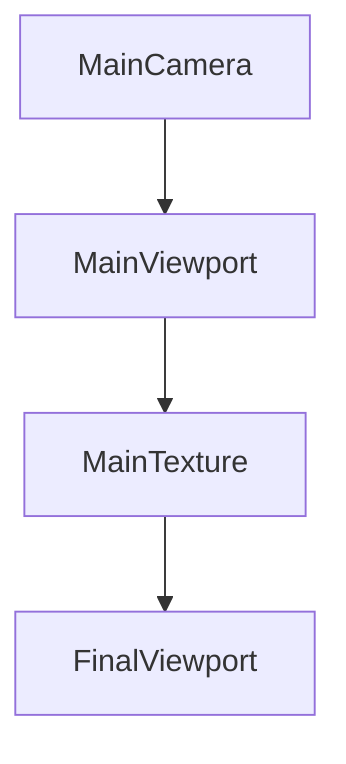

# A trivial shader sample using Norx

This is just a trivial port of the original ORX sample with a spinning logo, but using deffered rendering to apply post-processing effects

# Install sample3

First install ORX, Nim and Norx as described in top README.

Then run `nimble install` in this directory which will compile and install the `sample3` binary in release mode, or run `nimble run` without installing the binary.

ESC quits. Pressing the key below ESC (may be different depending on your keyboard, on mine it's "§" but evidently "`" on others I guess) opens the ORX console.

# Compiling

A Nim debug build will use `liborxd.so|dylib|dll`, a release build will use `liborx.so|dylib|dll` and if you build with `nim c -d:profile` it will use `liborxp.so|dylib|dll`.

# Rendering pipeline

To learn more about shaders, visit [The book of shaders](https://thebookofshaders.com/)
